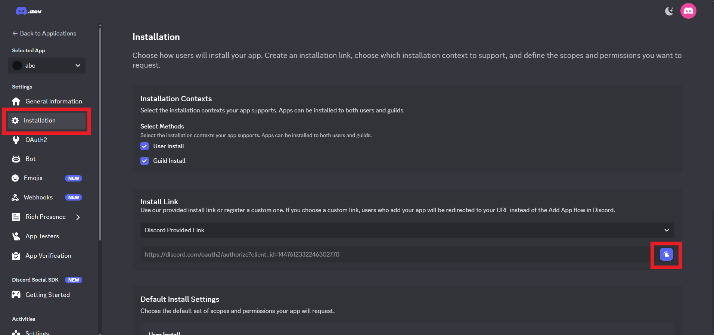

 

## 注册 Discord Bot
如果你还没有 Discord 账号的话 先去注册一个 ~~这应该不用教吧~~

### 注册
1. 进入 [Discord Developer Application](https://discord.com/developers/applications) 的网页

2. 点右上角的 New Application
    - 在 Name 栏位输入你希望让你的 Bot 叫什么名称
    - 点击 By clicking...... ~~( 翻译: 如果你点击 create(创建)，就代表你同意 Discord 的 [开发者服务条款(Developer Terms of Service)](https://support-dev.discord.com/hc/articles/8562894815383-Discord-Developer-Terms-of-Service) 和 [开发者政策(Developer Policy)](https://support-dev.discord.com/hc/articles/8563934450327-Discord-Developer-Policy) )~~
    - 点击 Create(创建)

### 开启权限
3. 创建之后，应该会进到这样的页面。点击左边 Settings 那栏的 Bot，接着要给 bot intents 才能让他正常运作

4. 点击后，往下滑，把这三个选项都打勾
    - 记得点底下的 Save Changes 这里就不截图了有点懒ww

5. (1) 点击左边那栏的 **Installation**，我们要让 Discord 知道它是 Bot ~~(因为单纯的 application 也可以被用来显示 discord 的状态(rich presence))~~
    - (2) 点击 **Scopes** 底下这个选单，把 bot 选上
    - 点了之后底下会出现 **Permission(权限)**，这是 Bot 进到服务器时，会被预设给的权限
    - 在那个选单里面点击以下几个选项
        - Add Reactions (添加反应)
        - Attach Files (发送文件、图片)
        - Connect (连接频道)
        - Embed Links (发送 embed，你平常看到那个排版很屌，但是自己却没方法可以打出来的东西)
        - Read Message History (阅读(频道)消息历史)
        - Send Messages (发送消息)
        - Speak (说话)
        - Use Slash Commands (使用斜线指令，我也不确定这用不用得到)
        - View Channels (查看频道)

### 取得 Token、邀请链接
6. 接着要取得 Token，这个超重要，没有它 你的 Bot 永远都不会启动
    - (1) 进到左边 Settings 那栏的 Bot    
    - (2) 点击 Reset Token
    - 点击红红的那个 (Yes, do it!)，他在问你是否确定要重置 Token
        - 因为我们根本没使用过这个 Bot，所以重置也无所谓
    - 点击后 他可能会需要你验证一下，可能要你输入密码。或者如果你开启多步骤验证(Multi-Factor)的话，可能也需要。

7. 结束之后，应该就可以看到你的 Token 了，复制它 (点 Copy，或者你想手动复制都可以)
    - **把这个 Token 留着，不要给别人，等等开启 Discord Bot 的时候会用到!**

8. 取得 Bot 邀请链接
